# 成分透視

Cosmetic Ingredient Lens 是一個以繁體中文（香港）為主的化妝品成分資料平台 MVP。它支援產品／成分搜尋、標籤相片 OCR、成分解析與配對、資料不足提示、來源追蹤、產品配方版本，以及待審核提交流程。

此平台報告「潛在關注」、「證據可信度」、「資料完整度」及「適用條件」。它不提供醫療診斷、懷孕安全聲明、治療建議，亦不使用單一安全分數。

## Architecture

```mermaid
flowchart LR
  web["apps/web Next.js"] --> parser["packages/ingredient-parser"]
  web --> ocr["packages/ocr"]
  web --> scoring["packages/scoring"]
  web --> shared["packages/shared"]
  web --> storage["packages/storage"]
  db["packages/database Prisma"] --> pg["PostgreSQL"]
  storage --> minio["MinIO / S3"]
```



## Prerequisites

- Node.js 24+
- pnpm 11+
- Docker with Docker Compose for PostgreSQL and MinIO

## Setup

```bash
cp .env.example .env
pnpm setup
docker compose up -d
pnpm db:migrate
pnpm db:seed
pnpm dev
```

Open `http://localhost:3000`.

## Scripts

- `pnpm dev`
- `pnpm build`
- `pnpm lint`
- `pnpm typecheck`
- `pnpm test`
- `pnpm test:e2e`
- `pnpm db:migrate`
- `pnpm db:seed`
- `pnpm db:studio`
- `pnpm setup`

## Environment Variables

See `.env.example`. Required local values include `DATABASE_URL`, `ADMIN_EMAIL`, `ADMIN_PASSWORD`, `AUTH_COOKIE_SECRET`, and MinIO-compatible `S3_*` variables.

## Development Admin

Default development credentials are:

- Email: `admin@example.test`
- Password: `change-me-in-dev`

Replace these in `.env` before any shared deployment.

## OCR Limitations

The first OCR provider uses local/browser Tesseract.js and is expected to be imperfect on reflective packaging, curved labels, low contrast, dense ingredient lists, and mixed Chinese/English labels. Users must review and correct OCR output before analysis or submission.

## Privacy

Users can analyse without storing an original photo. If they opt into contribution, they can submit text only or submit a processed image after metadata removal. Original uploaded images should never be publicly exposed by default.

## Data Coverage

Seed data is intentionally limited to fictional products and common ingredient identity records. Demo evidence is marked as development data and must not be treated as production evidence.
