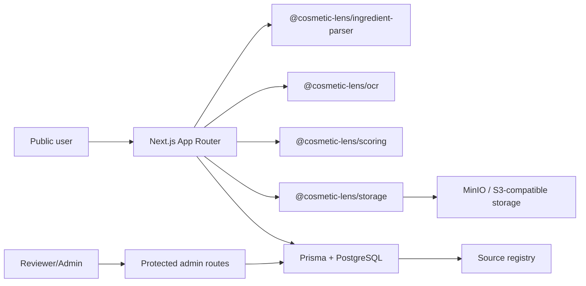

# Architecture

## Selected Stack

- pnpm workspace without a monorepo framework.
- Next.js App Router, strict TypeScript, Tailwind CSS v4, React Hook Form, Zod, and Playwright.
- Prisma ORM with PostgreSQL schema and migration artifacts.
- Browser/local OCR provider interface with Tesseract.js and deterministic test provider.
- Storage provider interface for MinIO/S3-compatible object storage.

## Replaceable Providers

- OCR: `OcrProvider`
- Storage: `ImageStorageProvider`
- Ingredient matching: parser package API
- Rating methodology: scoring package configuration
- Authentication: signed-cookie credentials provider with a migration path to Auth.js or another maintained provider
- Source import: manual/source registry first; no automated scraping in this milestone

## Local Data Mode

The first vertical slice uses audited development fixtures for public browsing so the site can run before Docker is started. PostgreSQL remains the production data contract through Prisma schema, migration, and seed script.

## Product Version Model

Public ProductVersion records preserve market, barcode, category, form, use pattern, body area, label observation date, independent verification date, brand confirmation date, source ids, evidence confidence, data completeness, and concern-dimension values.

Freshness is derived from observation and verification dates, newer conflicting submissions, and market-specific evidence. Historical formulations are not deleted or overwritten. A changed user-submitted ingredient list creates a possible reformulation review task with added, removed, and reordered ingredients for reviewer action.
