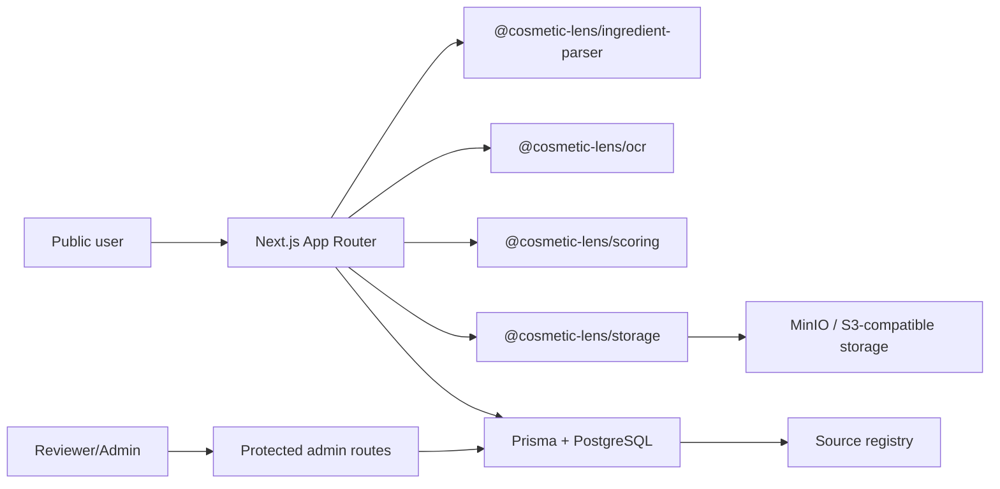
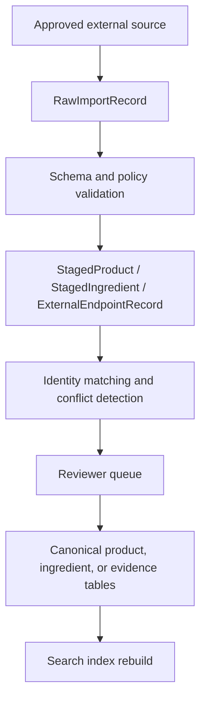

# Architecture

## Selected Stack

- pnpm workspace without a monorepo framework.
- Next.js App Router, strict TypeScript, Tailwind CSS v4, React Hook Form, Zod, and Playwright.
- Prisma ORM with PostgreSQL schema and migration artifacts.
- Browser/local OCR provider interface with Tesseract.js and deterministic test provider.
- Storage provider interface for MinIO/S3-compatible object storage.

## Replaceable Providers

- OCR: `OcrProvider`
- Storage: `ImageStorageProvider`
- Ingredient matching: parser package API
- Rating methodology: scoring package configuration
- Authentication: signed-cookie credentials provider with a migration path to Auth.js or another maintained provider
- Source import: `ProductDataImporter` providers gated by `DataSourcePolicy`; no unrestricted scraping

## Local Data Mode

The application starts with no preloaded consumer-facing products, brands, evidence claims, regulatory limits, or placeholder ratings. PostgreSQL remains the production data contract through Prisma schema and migrations. `pnpm db:bootstrap` creates required source-policy/reference rows only.

Test records are isolated inside test files and use clearly synthetic names and domains. They are not loaded into development or production database setup.

## Import Pipeline

Automated importers may run only when the source policy is approved or provisional, `importerEnabled` is true, licence and attribution metadata exist, and requested fields are limited to approved fields.

## Product Version Model

Public ProductVersion records preserve market, barcode, category, form, use pattern, body area, label observation date, independent verification date, brand confirmation date, source ids, evidence confidence, data completeness, and concern-dimension values.

Freshness is derived from observation and verification dates, newer conflicting submissions, and market-specific evidence. Historical formulations are not deleted or overwritten. A changed user-submitted ingredient list creates a possible reformulation review task with added, removed, and reordered ingredients for reviewer action.
