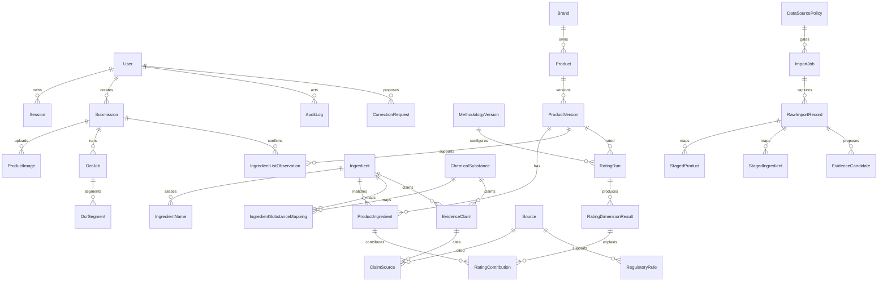

# Data Model

The database separates product observations, ingredient identity, chemical substances, evidence, regulatory rules, ratings, and audit history. Ingredient identity is an internal UUID and must never depend on a translated Chinese name.

## Key Rules

- Product versions are immutable; a changed normalised ordered ingredient list creates a new `ProductVersion`.
- Formula hash is deterministic from the normalised ordered ingredient tokens.
- Unmatched label tokens are stored in `ProductIngredient` with `match_status = unresolved`.
- `IngredientName.normalised_name` is indexed but not globally unique, because ambiguous aliases exist.
- Deleting sources referenced by active evidence must be restricted.
- Consumer-facing publication is blocked unless the record is tied to source provenance or an approved user observation.
- External imports land in raw/staging tables first; reviewer approval is required before canonical publication.
- Evidence claims must cite at least one real source before publication.
