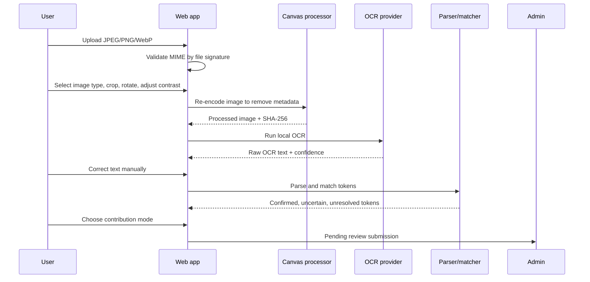

# OCR Pipeline

## Controls

- Supported files: JPEG, PNG, WebP.
- Validation uses magic bytes, not filename alone.
- Browser canvas re-encoding strips EXIF/GPS metadata for processed images.
- Original images are not saved unless the user selects the processed-image contribution option.
- OCR output and corrected text are stored separately.
- OCR results are never published without confirmation and review.

## Providers

- `BrowserTesseractOcrProvider`: first free local provider.
- `DeterministicOcrProvider`: stable tests and demos.
