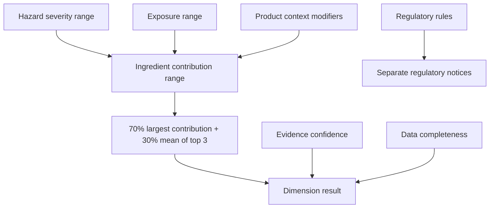

# Scoring Methodology

The MVP methodology is `mvp-0.1`. It is provisional and must not be represented as predicting disease probability, diagnosis, or absolute safety.

## Dimensions

1. 局部皮膚／眼睛關注
2. 過敏／致敏關注
3. 系統性健康關注
4. 呼吸／吸入關注
5. 環境關注
6. 法規及市場訊號

## Rules

- No single overall safety score.
- No calculation when hazard or exposure inputs are missing.
- Missing data is `資料不足`, not zero.
- Low evidence confidence does not reduce concern.
- Regulatory warnings are separate from numerical aggregation.
- Comedogenicity is separate and not part of the six MVP dimensions.
